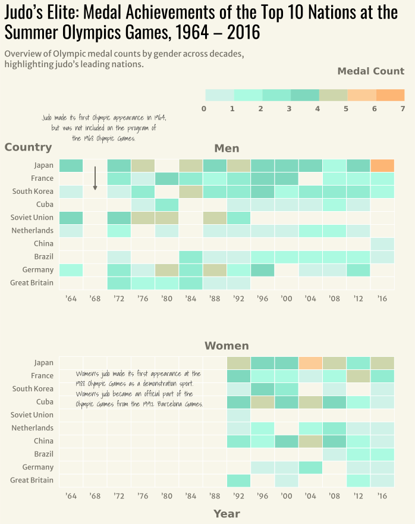
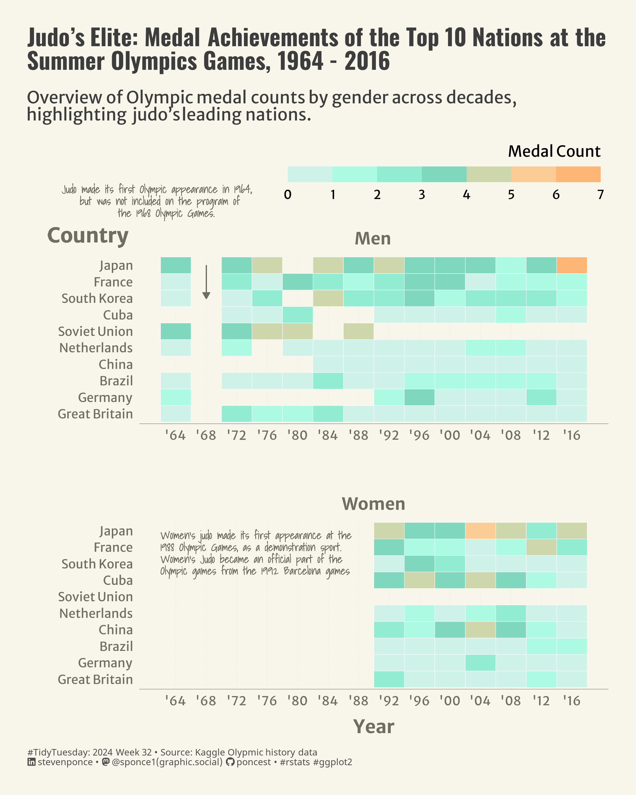

No problem — let’s update the README to cite the correct data source, and adjust the image embedding so GitHub will display them reliably. I’ll also mention the GitHub repo as the data source.

Here’s the revised `README.md`:

# 🥋 Judo’s Elite: Olympic Medal Achievements (1964–2016)

### Overview
This project recreates a visualization originally designed by **[Steven Ponce](https://x.com/sponce1/status/1821134942769725822)** for *#TidyTuesday (2024 Week 32)*.  
It was built as a **mini-project for my Data Visualization course**, where the goal was to **recreate an existing chart** using Python.

---

### 🎨 The Recreation

> Visualization of Olympic Judo medal counts for the top 10 nations (1964–2016), separated by gender and decade — highlighting the evolution of Judo in the Summer Games.

<p align="center">
  
</p>

---

### 🧩 Data Source
- **Dataset:** [TidyTuesday data – 2024-08-06 (“120 Years of Olympic History”)](https://github.com/rfordatascience/tidytuesday/tree/main/data/2024/2024-08-06)  
- **Filtered for:**
  - Summer Games only  
  - Sport = Judo  
  - Years 1964–2016  
  - Top 10 nations by total medal count  

---

### 🛠️ Tech Stack
- **Python 3.11+**  
- **Libraries:**
  - `pandas`, `numpy`  
  - `seaborn`, `matplotlib`  
  - `matplotlib.font_manager`  
- **Fonts:** Local TTFs (Oswald, Merriweather Sans, Noto Sans, Shadows Into Light)  

---

### 🗂️ Project Structure

```HTML
.
├── Data/
│   └── olympics.csv        ← Raw CSV from TidyTuesday dataset
├── fonts_dl/
│   ├── Oswald-Regular.ttf
│   ├── MerriweatherSans-Regular.ttf
│   ├── NotoSans-Regular.ttf
│   └── ShadowsIntoLight-Regular.ttf
├── Output/
│   ├── judo_elite_heatmaps_seaborn.svg
│   └── judo_elite_heatmaps_seaborn.png
├── References/
│   └── Pictures/
│       └── img.png         ← Original visualization by Steven Ponce
├── book.ipynb
├── requirements.txt
└── README.md
```

---

### 🖼️ Original Reference by Steven Ponce

<p align="center">
  
</p>

**Original:** [Steven Ponce on X](https://x.com/sponce1/status/1821134942769725822)  
**Challenge:** #TidyTuesday 2024 Week 32  
**Title:** *Judo’s Elite: Medal Achievements … 1964–2016*

---

### 📊 Design Notes
- **Color Palette:** Mint → Amber gradient representing medal counts 0–7  
- **Fonts:**  
  - Title – Oswald  
  - Labels/Body – Merriweather Sans  
  - Notes – Shadows Into Light  
  - Caption – Noto Sans  
- **Layout:** Two aligned heatmaps (Men / Women) with annotation and arrow  
- **Background:** Warm neutral tone for print-style aesthetic  

---

### 🧠 Insights
- Judo debuted in **1964**, was omitted in **1968**, returned afterwards  
- Women’s Judo: demonstration in **1988**, official from **1992**  
- Japan remains dominant; rising competition from France, South Korea, Cuba  

---

### 🎓 Project Context
Created by **Dominik Dierberger**  
as part of a **Data Visualization mini-project**  
– objective: recreate an existing diagram using Python & Seaborn.

---

### 📜 License
Project is for **educational & non-commercial use** only.  
Data via TidyTuesday / IOC.  
Original visualization © Steven Ponce.

---

### 👤 Author
**Dominik Dierberger**  
📅 *2025*  
🎓 *Data Visualization Course – Mini Project*
